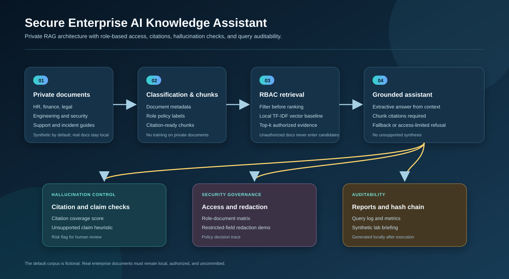
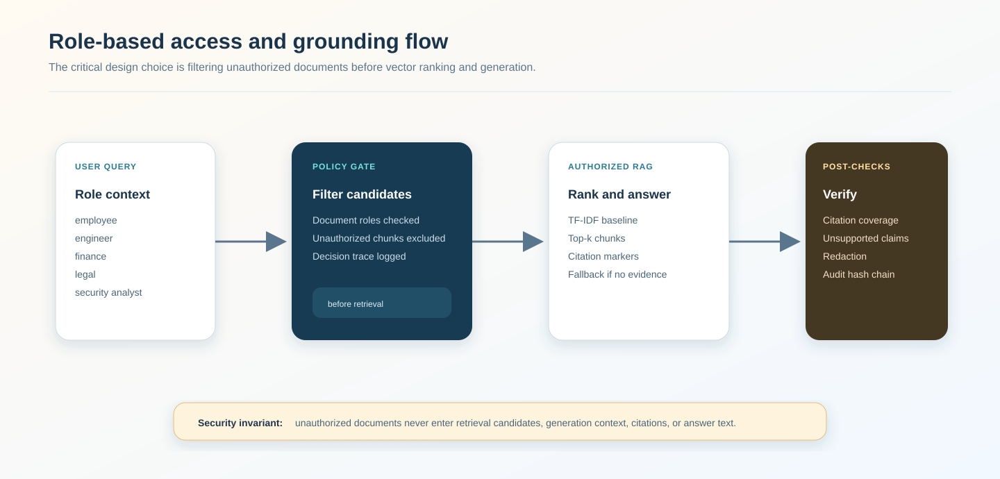
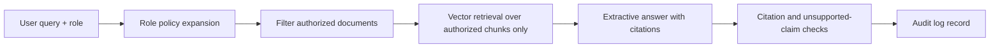

# Secure Enterprise AI Knowledge Assistant

<p align="center"><strong>Private RAG research platform with role-based access control, citation-grounded answers, hallucination checks, policy decision traces, local reports, and hash-chained audit logs.</strong></p>

<p align="center">
  <a href="../../actions/workflows/python-checks.yml"></a>
  <a href="LICENSE"></a>
  
  
</p>

> **Security boundary:** this independent research prototype uses fictional documents by default. It does not upload, train on, or commit private company documents. Real enterprise corpora require authorization, classification metadata, privacy review, and deployment controls.

---

## Research objective

Can a private enterprise RAG assistant provide citation-grounded answers from internal documents while enforcing role-based access control, preventing unsupported claims, and preserving auditable query traces?

| Research question | Evidence generated by local run |
| --- | --- |
| Does retrieval respect role permissions? | Access-control correctness and role-document matrix |
| Can answerable questions retrieve the right source? | Retrieval accuracy on answerable synthetic queries |
| Does the assistant refuse restricted or unavailable information? | Refusal accuracy and query-status chart |
| Are answers citation grounded? | Citation coverage and unsupported-claim score |
| Are query decisions auditable? | Hash-chained JSONL audit log and report |

---

## Architecture

<p align="center"></p>

The diagram is conceptual documentation. It is not a production deployment claim, security certification, or benchmark result.

| Layer | Function | Security control |
| --- | --- | --- |
| Document inventory | HR, finance, engineering, security, support, legal, incident-response, executive docs | Synthetic by default; real docs stay local |
| Classification metadata | Department, classification, allowed roles | Unknown permissions should default to restricted |
| Chunking | Citation-ready sentence chunks | Stable chunk IDs for auditability |
| RBAC retrieval | Filter unauthorized chunks before vector ranking | Core privacy invariant |
| Answer generation | Extractive answer from retrieved context only | No unsupported open-ended synthesis |
| Hallucination checks | Citation coverage and unsupported-claim heuristic | Risk flag for human review |
| Audit logging | Hash-linked JSONL records | Query traceability and tamper evidence |

---

## Run today — no private documents needed

```bash
python scripts/run_synthetic_rag_lab.py
```

Windows quick start:

```bat
cd %USERPROFILE%\secure-enterprise-ai-knowledge-assistant
git pull

py -m venv .venv
.venv\Scripts\activate

python -m pip install --upgrade pip
python -m pip install -r requirements.txt
python scripts/run_synthetic_rag_lab.py
```

Optional controls:

```bash
python scripts/run_synthetic_rag_lab.py --seed 42 --top-k 4
```

Generated local outputs:

```text
outputs/results/synthetic_documents.csv
outputs/results/synthetic_chunks.csv
outputs/results/synthetic_queries.csv
outputs/results/synthetic_rag_results.csv
outputs/results/synthetic_rag_answers.csv
outputs/results/synthetic_rag_summary.json
outputs/reports/synthetic_rag_report.md
outputs/audit/query_audit_log.jsonl

outputs/figures/synthetic_rag_metrics.png
outputs/figures/synthetic_query_status.png
outputs/figures/synthetic_access_matrix.png
```

Every output is synthetic and local. Results are generated by execution, not fabricated in the repository.

---

## Access-control design

<p align="center"></p>



The most important design rule is simple:

```text
Unauthorized documents never enter retrieval candidates, generation context, citations, or answer text.
```

---

## Synthetic enterprise corpus

| Document class | Example | Roles |
| --- | --- | --- |
| HR policy | Hybrid work and leave | employee, manager, HR, admin |
| Finance policy | Expense approval | finance, manager, admin |
| Engineering runbook | Production deployment | engineer, security analyst, admin |
| Security standard | Privileged access and secrets | security analyst, admin |
| Support FAQ | Customer escalation | employee, manager, support, admin |
| Legal memo | Contract and data processing | legal, manager, admin |
| Incident response guide | Evidence preservation and legal escalation | security analyst, legal, admin |
| Executive finance summary | Board planning | admin, finance, legal |

The corpus is fictional and designed to test access control, citation behavior, refusals, and grounding checks.

---

## RAG methodology

### Retrieval baseline

The first retriever is local TF-IDF cosine retrieval. It is intentionally transparent and deterministic. It provides a baseline before adding local embeddings, vector databases, or transformer rerankers.

### Generation baseline

The assistant uses extractive answer generation:

1. Retrieve authorized chunks.
2. Assemble short answer text from the retrieved chunks only.
3. Append chunk citations such as `[SEC-001::C00]`.
4. Refuse if the question is unsupported or restricted.

### Refusal behavior

| Situation | Response behavior |
| --- | --- |
| Authorized evidence found | Answer with citations |
| No authorized evidence found | “I don't know from the available authorized documents.” |
| Relevant content appears restricted | Access-limited refusal |
| Citation coverage missing | Hallucination-risk flag |

---

## Evaluation metrics

| Metric | Meaning | Boundary |
| --- | --- | --- |
| Retrieval accuracy on answerable queries | Top document matches expected synthetic source | Synthetic labels only |
| Refusal accuracy | Restricted/unavailable questions are refused | Synthetic labels only |
| Access-control correctness | No unauthorized document returned | Role-policy dependent |
| Mean citation coverage | Answer citations match retrieved chunks | Chunk-marker heuristic |
| Hallucination-risk rate | Any citation or unsupported-claim risk | Conservative heuristic |

These metrics are useful for regression testing and research communication, not production security certification.

---

## Audit log example

Each query creates a JSONL record with:

```text
query_id
role
status
top_doc_id
retrieved_chunk_ids
citation_count
citation_coverage
unsupported_claim_score
hallucination_risk
previous_hash
record_hash
```

The audit log is hash chained so altered history can be detected locally.

---

## Repository map

```text
.
├── assets/                         Conceptual architecture and RBAC diagrams
├── configs/                        Reproducible synthetic-lab configuration
├── data/                           Private-data boundary and future adapter notes
├── docs/                           Methodology, security model, synthetic lab, report template
├── matlab/                         Local metrics plotting script
├── notebooks/                      Synthetic RAG walkthrough
├── outputs/                        Local-only results, reports, figures, and audit logs
├── scripts/                        One-command synthetic enterprise RAG lab
├── src/enterprise_rag/
│   ├── synthetic.py                Fictional enterprise documents and labelled queries
│   ├── rbac.py                     Role hierarchy, authorization, redaction
│   ├── chunking.py                 Citation-ready chunks
│   ├── retrieval.py                TF-IDF retrieval with RBAC pre-filtering
│   ├── generation.py               Extractive citation-grounded answers
│   ├── hallucination.py            Citation and unsupported-claim checks
│   ├── evaluation.py               Synthetic lab metrics
│   ├── audit.py                    Hash-chained query audit log
│   ├── reporting.py                Local Markdown report
│   └── visualization.py            Metrics and access matrix figures
└── tests/                          RBAC, retrieval, grounding, audit, and pipeline tests
```

---

## MATLAB workflow

After running the Python lab:

```matlab
addpath('matlab')
plot_rag_metrics('outputs')
```

The MATLAB script reads `outputs/results/synthetic_rag_summary.json` and creates an additional local metrics figure.

---

## Real enterprise extension policy

The project is synthetic-first. To use real documents later:

1. Place authorized documents under `data/raw/`, which is ignored by Git.
2. Add metadata: `doc_id`, `title`, `department`, `classification`, `allowed_roles`, `content`.
3. Default unknown classifications to restricted.
4. Confirm legal/privacy/security authorization.
5. Use local retrieval infrastructure or approved enterprise services only.
6. Preserve audit logs and access traces.
7. Run prompt-injection and data-leakage tests before any deployment.

---

## Documentation

- [`docs/methodology.md`](docs/methodology.md): RAG, chunking, RBAC, generation, grounding, audit, and evaluation.
- [`docs/security_model.md`](docs/security_model.md): goals, threats, mitigations, and deployment caution.
- [`docs/synthetic_lab.md`](docs/synthetic_lab.md): command, outputs, and interpretation rules.
- [`docs/report_template.md`](docs/report_template.md): evidence-only report skeleton.
- [`data/README.md`](data/README.md): private-document boundary and future adapter fields.

---

## Reproducibility

- Fixed synthetic corpus and labelled query set.
- Deterministic TF-IDF retrieval baseline.
- Local generated CSV, JSON, Markdown, and figure outputs.
- Hash-chained audit log.
- Data-free tests and GitHub Actions workflow.

Run tests:

```bash
python -m pytest
```

## Limitations

1. Synthetic documents do not represent real enterprise complexity.
2. TF-IDF is a baseline and may miss semantic matches.
3. Role policies are simplified and not integrated with a real identity provider.
4. The hallucination check is heuristic, not a formal factuality proof.
5. The assistant is a research prototype, not legal, HR, finance, security, or operational advice.
6. Production use requires secure deployment review, privacy review, compliance review, monitoring, encryption, key management, and identity integration.

## License

Released under the [MIT License](LICENSE). Real enterprise documents are not included.
